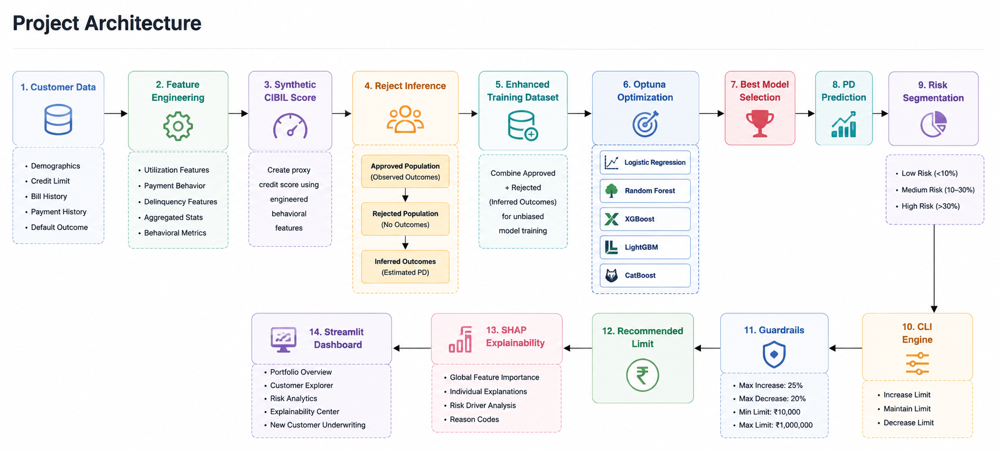

# CreditShield: AI-Powered Credit Risk Portfolio Optimization Engine

## Overview

CreditShield is an end-to-end Credit Risk Decisioning and Credit Limit Optimization platform that helps financial institutions assess borrower risk, predict Probability of Default (PD), optimize credit exposure, and generate explainable lending decisions.

The platform combines:

* Machine Learning-based PD prediction
* Optuna-driven model selection and hyperparameter optimization
* Risk Segmentation
* Credit Limit Increase (CLI) Engine
* Lending Guardrails
* SHAP Explainability
* Interactive Streamlit Dashboard

The system simulates a real-world retail banking underwriting workflow used for portfolio risk management and credit decisioning.

---

## 🌐 Live Dashboard

👉 **Streamlit App:**  
https://creditshield-ai-credit-risk-limit-optimization-c3jlu47twpokmub.streamlit.app/

> ⏳ *Note: App may take a few seconds to load (hosted on Streamlit Cloud)*
---

## Business Objective

Banks must balance:

* Portfolio Growth
* Credit Risk
* Customer Retention
* Regulatory Compliance

CreditShield enables lenders to:

* Predict default risk
* Identify high-risk borrowers
* Recommend credit limit actions
* Optimize portfolio exposure
* Generate transparent lending decisions

---

## Project Architecture



---

## Dataset

**UCI Default of Credit Card Clients Dataset**

* ~30,000 customers
* Demographic attributes
* Credit limit information
* Bill history
* Payment history
* Default indicator

---

## Feature Engineering

Built behavioral credit-risk features from payment and utilization history.

```text
LIMIT_BAL
delinquency_score
recent_delinquency
payment_ratio
avg_payment
current_utilisation
max_utilisation
```

Additional engineered features explored:

```text
synthetic_cibil
underpayment_count
debt_burden
avg_delay
max_delay
bill_std
utilization_ratio
latest_payment_ratio
```

---
## Reject Inference

Traditional credit risk models are trained only on approved applicants, creating selection bias because rejected applicants have no observed repayment outcomes.

To address this, CreditShield implements a Reject Inference pipeline to estimate the risk profile of previously rejected customers and create a more representative training dataset.

Approach-
Step 1: Synthetic Approval Policy

Step 2: Train Approval Population Model

Step 3: Infer Rejected Outcomes

Step 4: Build Final Modeling Dataset

```text
Approved Customers
        +
Rejected Customers (Inferred Labels)
        ↓
Reject-Inference Enhanced Dataset

### Final Model Features
```
---

## Model Development

### Models Evaluated

Using Optuna AutoML-style optimization:

* Logistic Regression
* Random Forest
* XGBoost
* LightGBM
* CatBoost

### Optimization Strategy

* Optuna Hyperparameter Tuning
* Stratified 5-Fold Cross Validation
* ROC-AUC Optimization
* Class-Imbalance Handling
* Threshold Optimization

### Best Model

Optuna selected:

```text
Weighted XGBoost Classifier
```

for final deployment.

---

## Performance

| Metric    | Score |
| --------- | ----- |
| ROC-AUC   | 0.82  |
| Precision | 0.59  |
| Recall    | 0.64  |
| F1 Score  | 0.62  |
| Accuracy  | 0.80  |

Threshold optimization was performed after training to maximize F1 Score.

---

## Credit Limit Optimization Engine

The platform converts PD predictions into actionable lending decisions.

### Risk Segmentation

| Segment     | PD Range  |
| ----------- | --------- |
| Low Risk    | < 10%     |
| Medium Risk | 10% – 30% |
| High Risk   | > 30%     |

### CLI Decision Logic

```text
Low PD + Low Utilization
        ↓
Increase Credit Limit

Medium Risk
        ↓
Maintain Credit Limit

High Risk
        ↓
Decrease Credit Limit
```

---

## Lending Guardrails

Business constraints prevent excessive exposure.

### Credit Policy

```text
Maximum Increase = 25%
Maximum Decrease = 20%

Minimum Limit = ₹10,000
Maximum Limit = ₹1,000,000
```

These controls ensure responsible lending and portfolio stability.

---

## Explainable AI

Implemented SHAP Explainability:

* Feature Importance
* Individual Prediction Explanations
* Risk Driver Analysis
* Underwriting Transparency

This enables model interpretability and regulatory-friendly decisioning.

---

## Streamlit Dashboard

### Executive Overview

Portfolio-level KPIs

* Customer Count
* Average PD
* Risk Mix
* Credit Exposure

---

### Customer Explorer

Customer-level analysis

* Predicted PD
* Risk Segment
* Credit Limit Decision
* Recommended Limit

---

### Risk Analytics

Portfolio monitoring

* PD Distribution
* Risk Segmentation
* Feature Importance
* Portfolio Risk Trends

---

### Explainability Center

SHAP-based explanations

* Waterfall Plots
* Feature Contributions
* Risk Drivers

---

### New Customer Underwriting

Manual underwriting simulator

Users enter:

```text
Credit Limit
Delinquency Score
Recent Delinquency
Payment Ratio
Average Payment
Current Utilization
Maximum Utilization
```

Outputs:

```text
Probability of Default
Risk Segment
CLI Decision
Recommended Limit
Final Guardrailed Limit
```

---

## Project Structure

```text
CREDIT-RISK-PORTFOLIO-OPTIMIZATION-ENGINE
│
├── data
│   └── UCI_Credit_Card.csv
│
├── models
│   └── finallll_xgb_model.pkl
│
├── notebooks
│   ├── Credit_Risk_Cleaned_Final_Model.ipynb
│   └── draft.ipynb
│
├── outputs
│   ├── final_xgb_model.pkl
│   └── pd_results_final.csv
│
├── app-checkpoint.py
│
├── requirements.txt
│
├── README.md
│
└── .gitignore
Clone repository:
```
---

## Installation

```bash
git clone https://github.com/Tushika2024/CreditShield-AI-Credit-Risk-Limit-Optimization
```

Install dependencies:

```bash
pip install -r requirements.txt
```

Run dashboard:

```bash
streamlit run app-checkpoint.py
```

---

## Future Enhancements
* Fair Lending Analysis
* Model Monitoring
* Drift Detection
* Portfolio Stress Testing
* Real Bureau Score Integration
* Real-Time API Deployment


